# Comparativa Manual vs Automatizado — ECOLIM S.A.C.

> **Proyecto:** App Android ECOLIM S.A.C. — Gestión de residuos (Kotlin + Compose Material 3 Expressive, Room offline-first, Retrofit REST sync)  
> **Pantallas:** Login / Home Dashboard / Nuevo Registro / Historial / Reportes  
> **Fecha:** Septiembre 2026

## 1. Objetivo

Cuantificar la mejora operativa obtenida al reemplazar el flujo manual en papel/Excel por el flujo automatizado de la aplicación móvil. Esta comparativa sustenta la justificación técnica y económica del proyecto y se alinea con los objetivos del curso: eficiencia operativa, cumplimiento de normas técnicas, seguridad y salud en el trabajo (SST) y protección del medio ambiente.

## 2. Metodología

- **Proceso manual:** flujo observado en operaciones de campo con planilla física, balanza manual, cámara externa y consolidación posterior en Excel.
- **Proceso automatizado:** flujo en la app ECOLIM (registro offline con Room + validación en formulario + captura de foto/ubicación + sincronización por lotes con `SyncWorker`).
- **Métrica de tiempo:** tiempo promedio por registro individual (un residuo pesado y fotografiado).
- **Tasa de errores:** registros con dato faltante, ilegible o inconsistente sobre el total.
- **Trazabilidad:** porcentaje de registros con evidencia completa y auditable (quién, cuándo, dónde, foto).

> **Nota sobre los datos:** Datos estimados con base en benchmarks de digitalización logística (fuentes: internet — estudios de caso de apps de campo). No provienen de una medición en producción de ECOLIM S.A.C.; se incluyen como referencia comparativa para el entregable académico. Los valores son conservadores y consistentes con reducciones de 70–90 % reportadas al migrar de papel a captura móvil.

## 3. Tabla comparativa por etapa

| Etapa | Proceso Manual (tiempo, errores, trazabilidad) | Proceso Automatizado — App (tiempo, errores, trazabilidad) | Mejora |
|---|---|---|---|
| **1. Identificación de residuo** | 8 min · Clasificación visual y consulta de tabla impresa. Errores: 5 % (confusión de tipo). Trazabilidad: 40 % (sin registro de operario) | 1,0 min · Selector `ResiduoTipo` (6 valores cerrados) + QR de zona/sector. Validación enum. Errores: 0,5 %. Trazabilidad: 98 % (`operarioId`, `timestamp` automático) | **−87,5 % tiempo** · −90 % errores |
| **2. Registro de peso / volumen** | 10 min · Lectura de balanza, transcripción manual y cálculo de volumen. Errores: 6 % (coma/decimal, unidad). Trazabilidad: 35 % | 1,5 min · Campos numéricos con validación (`pesoKg > 0`, `volumenM3 > 0`), teclado numérico y unidad fija. Errores: 0,5 %. Trazabilidad: 99 % (valor + timestamp + zona) | **−85 % tiempo** · −91 % errores |
| **3. Foto de evidencia** | 5 min · Cámara externa, descarga por cable, renombrado manual. Errores: 3 % (foto faltante o desvinculada). Trazabilidad: 25 % | 1,0 min · Captura integrada (CameraX) con `fotoUri` asociada al registro. Errores: 0,3 %. Trazabilidad: 98 % (foto + lat/lng + timestamp) | **−80 % tiempo** · −90 % errores |
| **4. Consolidación a Excel** | 12 min · Transcripción al final del turno, copia/pega entre planillas, fórmulas frágiles. Errores: 3 % (filas duplicadas/omitidas). Trazabilidad: 20 % | 0,5 min · Persistencia Room (`PENDIENTE` → `SINCRONIZADO` vía `SyncWorker`). Sin transcripción. Errores: 0,2 %. Trazabilidad: 98 % (`estado`, `remoteId`, `lastSyncError`) | **−95,8 % tiempo** · −93 % errores |
| **5. Reporte a autoridad** | 7 min · Armado manual de reporte, revisión y envío por correo. Errores: 1 % (formato, fecha). Trazabilidad: 30 % (versión única en archivo) | 1,5 min · `ReportsScreen` con filtros (`desde/hasta/zona/tipo`) + `GET /reportes` y exportación. Errores: 0,3 %. Trazabilidad: 98 % (agregados auditables, `GET /reportes` centralizado) | **−78,6 % tiempo** · −70 % errores |
| **6. Trazabilidad integral** | 3 min · Búsqueda en archivador físico / Excel disperso. Errores: —. Trazabilidad base: 30 % (evidencia incompleta) | 1,5 min · `HistoryScreen` con filtros por tipo/zona/fecha + foto + ubicación + operario. Errores: 0,2 % (registro sin foto opcional). Trazabilidad: 98 % | **−50 % tiempo** · +68 pp trazabilidad |
| **TOTAL** | **45 min · Errores: 18 % · Trazabilidad: 30 %** | **7 min · Errores: 2 % · Trazabilidad: 98 %** | **−84 % tiempo · −89 % errores · +227 % trazabilidad** |

### Lectura del total

- **Tiempo total:** 45 min → 7 min = **−38 min (−84 %)** por ciclo de registro y reporte.
- **Tasa de errores:** 18 % → 2 % = **−16 puntos porcentuales (−89 % relativo)**.
- **Trazabilidad:** 30 % → 98 % = **+68 pp (+227 % relativo)**; cada registro queda vinculado a operario, zona, timestamp, foto y coordenadas.

## 4. Visualización comparativa

### 4.1 Gráfico Mermaid (barras)

```mermaid
xychart-beta
    title "Comparativa — Tiempo por registro (min) y Trazabilidad (%)"
    x-axis ["Manual" , "App ECOLIM"]
    y-axis "Valor" 0 --> 100
    bar [45, 7]
    bar [30, 98]
```



> Si el render de `xychart-beta` no está disponible en el visor PDF, usar el bloque ASCII siguiente.

### 4.2 Comparación ASCII (compatible con PDF sin Mermaid)

```
Tiempo total por ciclo (min) — menor es mejor
Manual  : █████████████████████████████████████████████ 45 min
App     : ███████                                        7 min  (-84%)

Tasa de errores (%) — menor es mejor
Manual  : ██████████████████ 18%
App     : ██              2%  (-89%)

Trazabilidad (%) — mayor es mejor
Manual  : ███████████████                    30%
App     : █████████████████████████████████████████████████ 98% (+68 pp)

Escala ASCII normalizada a 50 caracteres (máx. 45 min / 100%).
```

## 5. Impacto operativo proyectado

| Indicador | Efecto estimado |
|---|---|
| **Registros por turno (8 h)** | De 10–11 registros a 55–65 registros por operario (+5×), liberando tiempo para recolección efectiva. |
| **Horas recuperadas** | 38 min por ciclo × 8 ciclos/día ≈ **5 h/día** por cuadrilla de 4 operarios. |
| **Retrabajo evitado** | De 18 errores cada 100 registros a 2; reducción de correcciones y reinspecciones en campo. |
| **Auditoría** | 98 % de registros auditables habilita reportes a autoridad sin armado manual y con evidencia fotográfica y georreferenciada. |

## 6. Conclusión — Vinculación con objetivos del curso

1. **Eficiencia y normas técnicas:** la reducción de 84 % en tiempo y 89 % en errores demuestra la aplicación de principios de ingeniería de software (validación en origen, modelo tipado con Room, sincronización desacoplada con WorkManager) y de normas de calidad de datos. Se elimina la doble digitación, se estandariza el dominio con `ResiduoTipo` (enum cerrado) y se garantiza consistencia con claves foráneas y validaciones en `RegistroEntity`.
2. **Seguridad y salud en el trabajo (SST):** el campo `eppCompleto` y la foto de evidencia permiten verificar el uso de equipo de protección personal en cada registro. Menos tiempo en tareas administrativas implica menos exposición en zonas de riesgo y más control preventivo desde `HomeDashboardScreen` (contador de pendientes y estado de sincronización).
3. **Medio ambiente:** la trazabilidad de 98 % habilita reportes confiables por tipo de residuo, zona y periodo (`GET /reportes?desde=&hasta=&zona=`), base para indicadores de valorización, segregación y disposición final. La digitalización reduce consumo de papel y habilita decisiones oportunas para el cumplimiento ambiental ante la autoridad competente.
4. **Sostenibilidad del sistema:** el diseño offline-first (Room + Retrofit + `SyncWorker` con `NetworkType.CONNECTED`) asegura continuidad operativa en rutas con conectividad intermitente, condición crítica en operaciones de residuos sólidos fuera de zona urbana.

> **En síntesis:** la app ECOLIM transforma un proceso fragmentado de 45 minutos y baja auditabilidad en un flujo integrado de 7 minutos con evidencia completa, cumpliendo simultáneamente los objetivos de eficiencia, calidad, SST y responsabilidad ambiental exigidos en el curso.

## 7. Referencias cruzadas

- `docs/ERD.md` — modelo relacional, índices y estrategia offline-first.
- `docs/API_SIMULATION.md` — contratos `POST /registros`, `GET /reportes`, `GET /zonas` y mock con MockWebServer.
- `data/local/entity/RegistroEntity.kt` — campos `fotoUri`, `lat/lng`, `eppCompleto`, `estado`, `remoteId`.
- `data/work/SyncWorker.kt` — sincronización por lotes con reintento y backoff.

---
*Documento preparado para entrega académica — ECOLIM S.A.C. — Septiembre 2026.*
