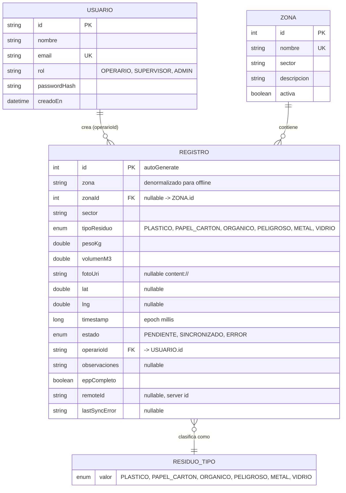

# Modelo de Base de Datos — ECOLIM S.A.C.

## Diagrama Entidad-Relación (Mermaid)



### Notas del modelo

- **Usuario 1—N Registro**: cada registro guarda `operarioId` (FK lógico). No se impone FK estricto a tabla de usuarios porque la autenticación puede venir de API; localmente se guarda el id como string para permitir offline.
- **Zona 1—N Registro**: FK formal `zonaId -> zonas.id` con `ON DELETE SET NULL` + campo `zona` denormalizado para mostrar nombre sin join cuando se está offline.
- **Registro — ResiduoTipo**: no es tabla, es `enum` almacenado como `TEXT` con `TypeConverter`. Simplifica filtros y evita join innecesario; el dominio es cerrado (6 valores).
- **Índices**: `zona`, `zonaId`, `tipoResiduo`, `timestamp`, `estado`, `operarioId` para acelerar filtros de reportes y cola de sincronización (`WHERE estado = 'PENDIENTE'`).

### Esquema SQLite (Room)

```sql
CREATE TABLE zonas (
  id INTEGER PRIMARY KEY AUTOINCREMENT NOT NULL,
  nombre TEXT NOT NULL,
  sector TEXT NOT NULL,
  descripcion TEXT,
  activa INTEGER NOT NULL DEFAULT 1
);
CREATE UNIQUE INDEX index_zonas_nombre ON zonas(nombre);

CREATE TABLE registros (
  id INTEGER PRIMARY KEY AUTOINCREMENT NOT NULL,
  zona TEXT NOT NULL,
  zonaId INTEGER,
  sector TEXT NOT NULL,
  tipoResiduo TEXT NOT NULL,
  pesoKg REAL NOT NULL,
  volumenM3 REAL NOT NULL,
  fotoUri TEXT,
  lat REAL,
  lng REAL,
  timestamp INTEGER NOT NULL,
  estado TEXT NOT NULL,
  operarioId TEXT NOT NULL,
  observaciones TEXT,
  eppCompleto INTEGER NOT NULL DEFAULT 0,
  remoteId TEXT,
  lastSyncError TEXT,
  FOREIGN KEY(zonaId) REFERENCES zonas(id) ON DELETE SET NULL
);
CREATE INDEX index_registros_zona ON registros(zona);
CREATE INDEX index_registros_zonaId ON registros(zonaId);
CREATE INDEX index_registros_tipoResiduo ON registros(tipoResiduo);
CREATE INDEX index_registros_timestamp ON registros(timestamp);
CREATE INDEX index_registros_estado ON registros(estado);
CREATE INDEX index_registros_operarioId ON registros(operarioId);
```

## Ventajas SQLite + sincronización REST

**SQLite (Room) como base offline-first:**

1. **Operación sin conectividad**: los operarios en campo (rellenos sanitarios, rutas rurales) registran sin señal; la inserción local es < 50 ms y no bloquea la UI.
2. **Transaccional y tipado**: Room valida esquema en compilación, usa `Flow` para UI reactiva y transacciones ACID para no perder datos si la app se cierra.
3. **Consultas locales rápidas**: índices permiten filtrar reportes por fecha/tipo/zona sin red, ideal para `HistoryScreen` y `ReportsScreen` offline.
4. **Bajo costo**: sin servidor intermedio, sin latencia de red percibida.

**REST API como fuente de sincronización:**

1. **Sistema de registro**: el servidor centraliza datos de múltiples dispositivos, permite auditoría, dashboards gerenciales y respaldo.
2. **Interoperabilidad**: cualquier cliente (web, app) consume el mismo contrato `POST /registros`, `GET /reportes`.
3. **Escalabilidad**: el servidor agrega validación, deduplicación y almacenamiento a largo plazo que SQLite no debe asumir.

**Sincronización por lotes (Batch Sync):**

- Escritura siempre a SQLite con estado `PENDIENTE`; `SyncWorker` (WorkManager con `NetworkType.CONNECTED`) empuja el lote vía `POST /registros` cuando hay red. Ventajas: desacopla latencia percibida de latencia real, tolera redes móviles inestables, y permite reintentos con backoff sin intervención del usuario. Costo: consistencia eventual (el servidor puede ir segundos/minutos atrás), que se mitiga marcando `SINCRONIZADO` y mostrando contador de pendientes en `HomeDashboardScreen`.

En conjunto, el modelo cumple el requisito del entregable: **modelo de base de datos relacional + consumo de API RESTful con estrategia offline-first**.

## Referencias

- `data/local/EcolimDatabase.kt` — definición `@Database(version=1)`
- `data/local/entity/RegistroEntity.kt` — entidad principal con KDoc de ventajas
- `data/local/entity/ZonaEntity.kt` — tabla de zonas
- `data/repository/RegistroRepository.kt` — orquestación DAO + API
